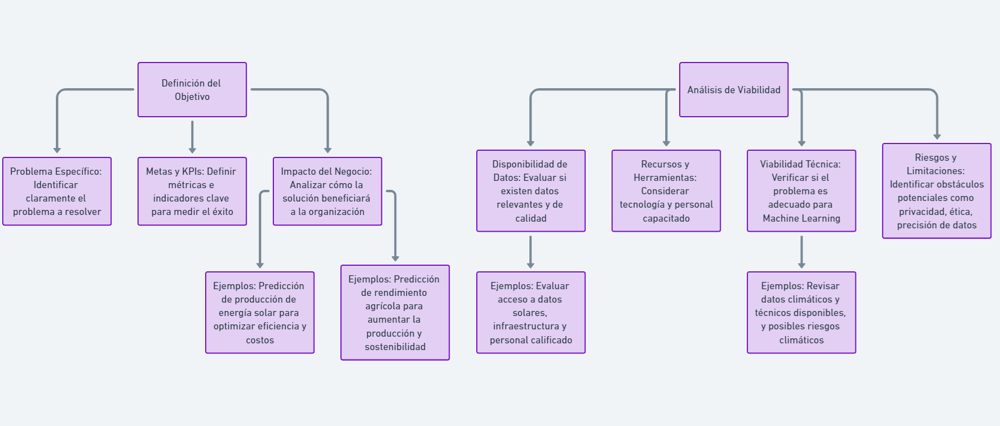
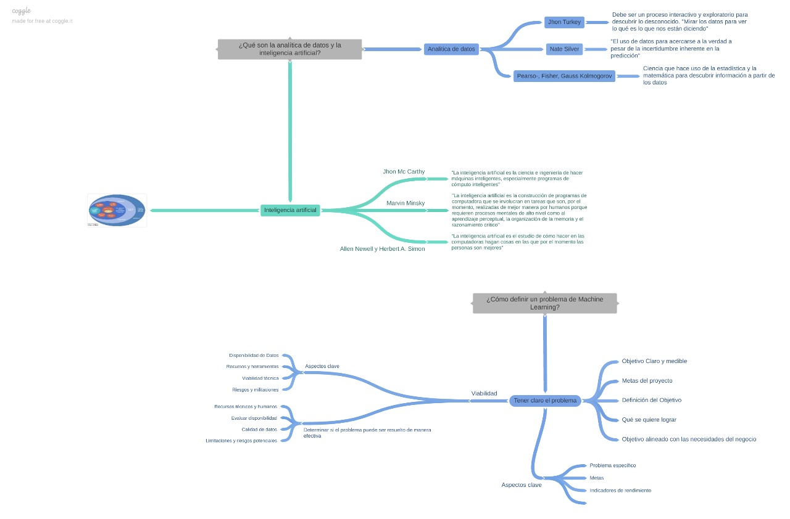
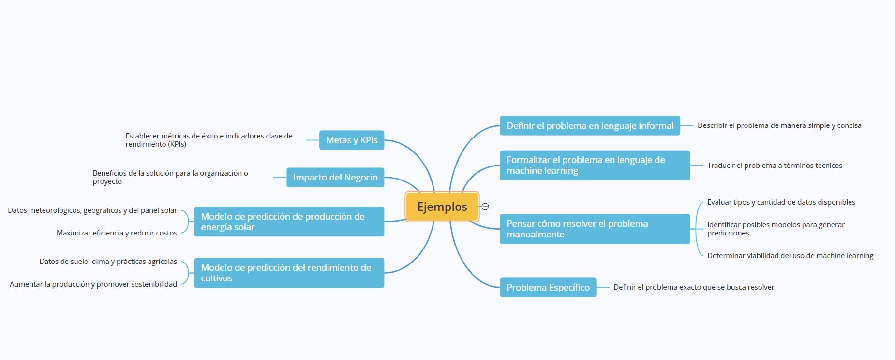
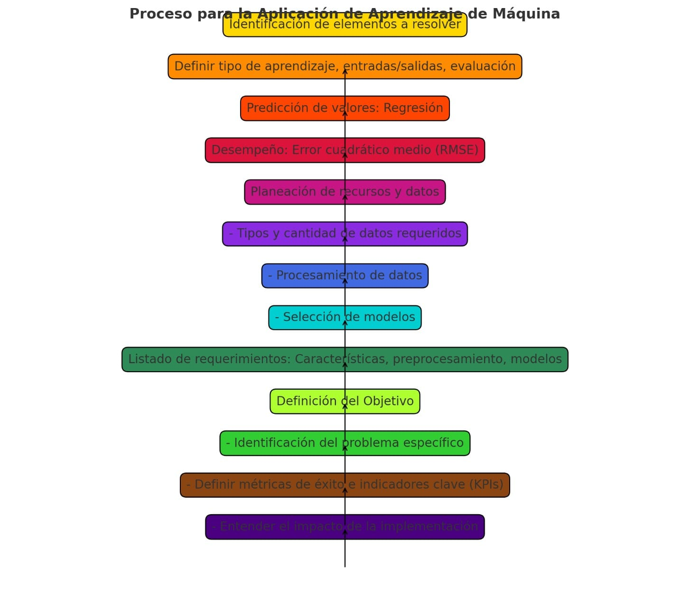

****Danicp97-patch-1
Grupo X

Daniel Calle Pulgarin, Jesus Alonso Combariza

Tema 3

# Identificación del Problema en el Ciclo de Vida de una Aplicación de Aprendizaje de Máquina

# ¿Cómo DEFINIR UN PROBLEMA de Machine Learning?	 

## Definir un problema de Machine Learning (ML) implica estructurar claramente el objetivo y los aspectos clave que el modelo debe resolver. Aquí te dejo un enfoque para definirlo de manera eficaz:

# 1.	Identificar el problema:
o	¿Qué desafío específico estás tratando de resolver con ML?
o	Ejemplos: Predecir la demanda de un producto, clasificar correos electrónicos como spam o no spam, o detectar fraudes en transacciones.

# 2.	Definir el tipo de problema de ML:
o	Clasificación: Si el objetivo es asignar una etiqueta a un conjunto de datos (ej., spam/no spam).
o	Regresión: Cuando se busca predecir un valor continuo (ej., el precio de una casa).
o	Clustering: Si el objetivo es agrupar datos en categorías sin etiquetas predefinidas (ej., segmentación de clientes).
o	Series temporales, detección de anomalías, etc.

# 3.	Definir la variable objetivo (target):
o	¿Qué variable o resultado estás intentando predecir?
o	Por ejemplo: en un problema de predicción de precios, la variable objetivo es el precio.

# 4.	Definir las características (features):
o	¿Qué información utilizarás para hacer las predicciones? Las características son las variables que alimentarán al modelo (ej., edad, ingresos, ubicación).
o	Aquí es importante identificar si tienes datos relevantes y suficientes para abordar el problema.

# 5.	Disponibilidad de datos:
o	¿Cuentas con datos adecuados y suficientes para entrenar el modelo?
o	¿Están estos datos limpios, etiquetados y listos para su uso?

# 6.	Criterio de éxito:
o	¿Cómo sabrás si el modelo está funcionando bien? Define métricas claras como precisión, recall, error cuadrático medio (MSE), etc.
o	Por ejemplo: un modelo de clasificación puede evaluarse con la precisión, mientras que un modelo de regresión puede medirse con el error promedio.

# 7.	Limitaciones y restricciones:
o	¿Existen restricciones en cuanto al tiempo, recursos computacionales o disponibilidad de datos que puedan influir en la implementación?

# 8.	Impacto en el negocio o contexto:
o	¿Cómo beneficiará la solución basada en ML al negocio o al contexto en el que se va a aplicar?

# 9.	  Selección de algoritmo:
•	¿Qué tipo de algoritmo es más adecuado para el problema? Dependiendo del tipo de datos, puedes optar por árboles de decisión, redes neuronales, modelos de regresión, etc. Esto influirá en la forma en que se entrena y ajusta el modelo.

# 10.	 Preprocesamiento de datos:
•	¿Los datos requieren alguna limpieza o transformación antes de entrenar el modelo?
•	Esto incluye manejar valores perdidos, eliminar outliers, normalizar datos, o convertir variables categóricas en numéricas.

# 11.	  División de los datos:
•	¿Cómo dividirás los datos en conjuntos de entrenamiento, validación y prueba? Esto es crucial para evitar sobreajuste (overfitting) y asegurarte de que el modelo generalice bien a datos nuevos.

# 12.	  Ciclo de vida del modelo:
•	¿Cómo será el proceso de despliegue del modelo? Una vez que el modelo esté entrenado y validado, debes definir cómo se implementará en producción y cómo se actualizará o ajustará conforme lleguen nuevos datos.

# 13.	 Costos de errores:
•	¿Cómo afecta cada tipo de error (falsos positivos vs. falsos negativos)? Dependiendo del problema, ciertos errores pueden tener un mayor impacto. Por ejemplo, en un modelo de detección de fraude, un falso negativo puede ser más costoso que un falso positivo.

# 14.	  Interpretabilidad del modelo:
•	¿Necesitas que el modelo sea fácilmente interpretable? Algunos modelos, como los árboles de decisión, son más interpretables que otros, como las redes neuronales. Esto puede ser importante en áreas como la medicina o las finanzas, donde la transparencia es esencial.

# 15.	  Consideraciones éticas:
•	¿El modelo tiene el potencial de causar sesgos o discriminación? Es fundamental evaluar cómo los datos y el modelo pueden afectar a diferentes grupos y si hay riesgos de perpetuar desigualdades.

# 16.	  Monitoreo del rendimiento:
•	Una vez en producción, ¿cómo monitorearás el rendimiento del modelo? Los datos y los patrones pueden cambiar con el tiempo (drift), y es importante tener un sistema para detectar cuándo el modelo necesita ser actualizado o recalibrado.

# Ejemplo 1: 
En el contexto de la transición energética justa y el impulso a energías limpias, una empresa puede querer optimizar la generación de energía solar en diferentes regiones. 
El objetivo podría ser :
"Desarrollar un modelo que prediga la producción de energía solar basada en datos meteorológicos, ubicación geográfica y características del panel solar, para maximizar la eficiencia y reducir costos."
 
Para el proyecto de optimización de la generación de energía solar, la empresa evalúa si tiene acceso a suficientes datos históricos de producción de energía solar;
datos meteorológicos precisos y detallados, y datos de características de paneles solares. 
También considera si tiene la infraestructura tecnológica adecuada y el personal calificado (científicos de datos, ingenieros de energía).
para llevar a cabo el proyecto. Se analizan los posibles riesgos relacionados con la precisión de los datos meteorológicos y la variabilidad en la producción de energía.

# Grupo 1 - Seis Neuronas

## Integrantes

- Claudia Cárdenas
  
- Claudia Lorena Ramírez
  
- Maria Victoria Valencia
  
- Jaime Andrés Londoño
  
- Geovanny Vergara
  
- Javier Andrés Vargas

### **Tema 3**

# Grupo 5

## INTEGRANTES:

»Roberto Sanchez

»jhoksser Mejia

»Esteban Ruiz

»Wilmer jamioy

»Edison Echavarria

»Victor Gutierrez

»Luis Fernando Meneses

»Valentina Cepeda

## Nueva imagen

=======
# GRUPO 3

# Como Definir un problema de Machine Learning

Recoger los datos, predecir con valores y tener un listado de estrategias

## 1. Definir el problema usando un lenguaje informal 
	Es el primer paso crucial en la identificación del problema, describir el problemas en pocas palabra de forma muy concisa de tal manera que cualquiera sin ser experto pueda entenderlo. 
	
## 2. Formalizar el problema usando el lenguaje de machine learning 
	Debemos traducir el problema a un lenguaje técnico o machine learning 
	
## 3. Pensar cómo resolveríamos el problema manualmente
    Debemos de pensar que tipos de datos y cuantos datos tenemos al igual que donde vamos a recolectar y que tipos de modelos podemos usar para genera las predicciones. Con esta paso podemos que tan viable para saber si debemos de usar modelos de machine learning 

### Al seguir este proceso podemos ahorrar tiempo ya que al seguir cada paso podemos indentificar si contamos con todos los elementos encesarios para hacer uso de machine learning

 

### <b>Problema Específico:</b> Identificar el problema exacto que se desea resolver.
 

### <b>Metas y KPIs:</b> Definir las métricas de éxito y los indicadores clave de rendimiento (KPIs) que permitirán evaluar si el objetivo se ha alcanzado.

 

###  <b>Impacto del Negocio:</b>

Entender cómo la solución del problema beneficiará a la organización o al proyecto.

## Integrantes
* Carlos Perea
* Kevin Tejada

# Grupo 6
## Integrantes:

-Diana Arias
-Jairo Acosta
-Diana Maribel Balaguera
-José Cardeño
-Carlos Dario Bolaños
-Maritza Parra
-Ximena Perez
-Neider Usuga
-Francia Elena Loaiza
-Sebastian Garcia

# Grupo 2
## Integrantes 

-Miguel
-Luis
-Yimer
-Carlos B
-D

